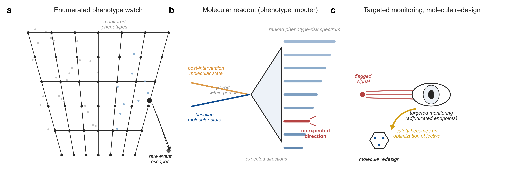
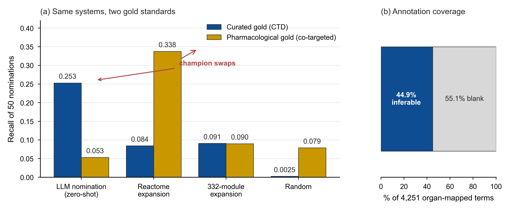

<div align="center">

# SteeraMed-Toxicity: From Rare Toxicity Signals to Trial Decisions
# SteeraMed-Toxicity：从罕见毒性信号到试验决策

**The Semaglutide Case and a Benchmark for Language Models**
**司美格鲁肽案例与语言模型基准**

**A module of the [SteeraMed](https://steeramed.com) framework**
**[SteeraMed](https://steeramed.com) 框架的模块**

[](https://steeramed.com)
[](LICENSE)
[]()

</div>

---

[English](#english) | [中文](#中文)

---

<a name="english"></a>

## Can language models rank the harms nobody listed?

Semaglutide became a safety concern after clinicians saw three patients with
sudden vision loss in one week — all taking the drug. The case exposes three
gaps in drug safety: a **representation gap** (individual vulnerability is
poorly captured), a **prediction gap** (short-lived, rare harms are hard to
forecast), and an **inference gap** (mixed evidence is not consistently turned
into clear, testable trial decisions).

SteeraMed-Toxicity is a benchmark for language models: can they rank uncommon,
unexpected drug harms and flag signals for clinical review? The longer-term
goal is to learn whether these rankings can help trial teams choose what to
monitor.

### Framework overview



### Key findings (pilot, 60 drugs)

- **The long tail is where models matter**: the model beat every frequency-based
  baseline on long-tail label recall (3.8–4.3% versus 0–0.5%) — global
  frequency retrieved none, and no rarity-seeking reweighting did better
- **Honest baseline**: a similar-drug label-transfer baseline retrieved far
  more of the tail (2.7%); the model's edge over it was **not statistically
  distinguishable** at this sample size
- **Generic prior dominates the head**: under target-only input, random genes
  scored the same as real targets overall (0.64 versus 0.61), while real
  targets kept a small advantage on low-prevalence terms (+0.010 to +0.014,
  both CIs above zero) — mechanism information is visible **only in the tail**
- **The miss was in the ranking, not the knowledge**: free ranking never
  mentioned the eye for semaglutide or tirzepatide; asked directly, the model
  put diabetic retinopathy second and optic neuropathy tenth
- **Gold standards can disagree**: a gene-level probe found the best
  nomination method **reverses** when the validation frame changes from
  curated annotations to co-targeting — what counts as "related" is a framing
  choice



## Boundaries

This pilot shows that rare, unexpected adverse-effect ranking **can be
measured**. It does **not** show that a model could have predicted the
semaglutide–NAION signal, that paired molecular profiles improve prediction,
or that using the benchmark improves Phase II trial success. Those questions
require held-out tests on clinical decisions, followed by prospective
evaluation.

## Repository status

> **Version 1 (setup).** This repository provides the framework overview and
> representative figures. The analysis code, frozen outputs, benchmark
> protocol, and reproduction scripts will be released with the preprint (v2).

## Citation

```bibtex
@article{xiong2026toxicity,
  title={From Rare Toxicity Signals to Trial Decisions: The Semaglutide Case
         and a Benchmark for Language Models},
  author={Xiong, Jianghui},
  journal={Preprints},
  year={2026},
  note={Preprint forthcoming. Code and frozen artifacts:
        https://github.com/DeepoMe/SteeraMed-Toxicity}
}
```

## Links

- **[SteeraMed](https://steeramed.com)** — the broader framework
- **[SteeraMed-RootMap](https://github.com/DeepoMe/SteeraMed-RootMap)** — companion dependency-map repository
- **[SteeraMed-MorbiMap](https://github.com/DeepoMe/SteeraMed-MorbiMap)** — companion candidate-ranking repository
- **[SteeraMed-bench](https://github.com/DeepoMe/SteeraMed-bench)** — companion benchmark repository
- **[DeepoMe](https://steeramed.com)** — the organization behind this work

## License

MIT (code) / CC BY 4.0 (data and documentation)

## Contact

Jianghui Xiong — [jianghui@deepome.com](mailto:jianghui@deepome.com)

---

<a name="中文"></a>

## 语言模型能排出"没人写进说明书"的 harms 吗？

司美格鲁肽成为安全关切，源于一周内三位突发视力丧失患者——都在用该药。
这一案例暴露药物安全的三个缺口：**表征缺口**（个体易感性刻画不足）、
**预测缺口**（罕见短程 harm 难以预测）、**推断缺口**（混杂证据未被一致
转化为清晰可检验的试验决策）。

SteeraMed-Toxicity 是一个面向语言模型的基准：能否对不常见、意外的药物
harm 排序，并为临床复核标记信号？

### 核心发现（试点，60 药）

- **长尾是模型的用武之地**：长尾标签召回 3.8–4.3% 对频率基线 0–0.5%——全局频率检索为零，稀有加权也无效
- **诚实的基线**：同类药标签迁移基线长尾召回 2.7%，模型对它的优势在当前样本量下**无统计学区分度**
- **头部被通用先验主导**：仅靶点输入下，随机基因与真实靶点总分相同（0.64 对 0.61）；真实靶点仅在低流行词上保持小优势（+0.010 至 +0.014，置信区间均不含 0）——**机制信息只在尾部可见**
- **漏在排序，不在知识**：自由排序从不提及司美格鲁肽/替尔泊肽的眼部风险；直接询问时模型将糖网放第 2、视神经病变第 10
- **金标准会互相反对**：基因层探针发现，验证框架从策展注释换为共靶向时，最优提名方法**反转**——"相关"的定义本身是一种框架选择

## 边界

本试点证明罕见意外不良反应排序**可测量**。不能证明模型可预测司美格鲁肽-NAION
信号、配对分子谱可改进预测、或使用本基准可提高 II 期试验成功率——这些问题
需要对临床决策的留出检验与前瞻评估。

## 仓库状态

> **版本 1（建设期）。** 当前提供框架总览与代表性图件。分析代码、冻结输出、
> 基准协议与复现脚本将随预印本发布（v2）。

## 许可

MIT（代码）/ CC BY 4.0（数据与文档）

## 联系方式

熊江辉 — [jianghui@deepome.com](mailto:jianghui@deepome.com)

[DeepoMe](https://steeramed.com) · [SteeraMed](https://steeramed.com)
